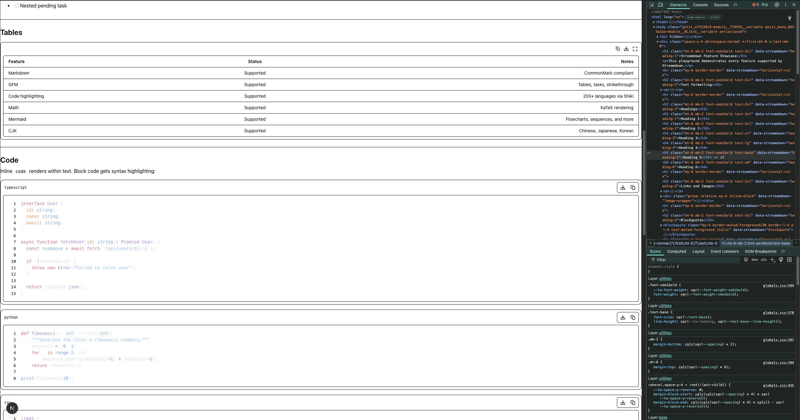
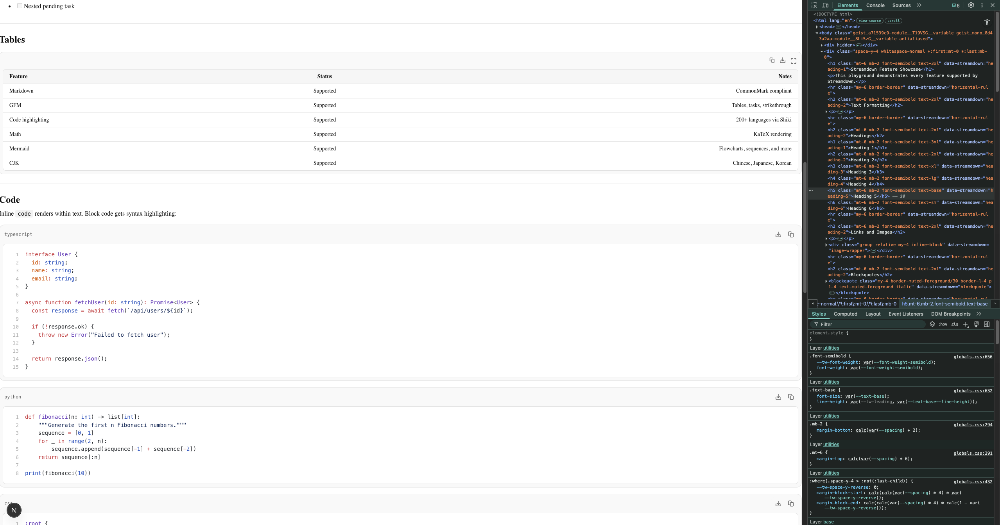
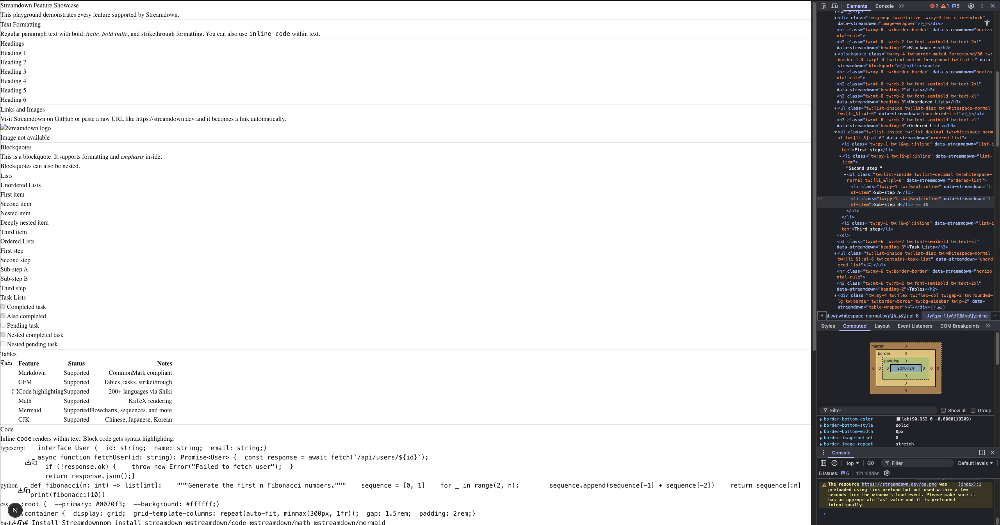

# Streamdown Repro Repo

This repo reproduces two issues with [streamdown](https://github.com/vercel/streamdown).

## Issues

### 1. Shadcn Theming Assumption

Without the `globals.css` changes that shadcn provides (CSS custom properties for colors, border-radius, etc.), the styling of all components - particularly cards like code blocks - looks off and has no proper styling.

The [official streamdown docs](https://streamdown.ai) don't mention shadcn anywhere, so the expectation is that it shouldn't be required. Is this dependency intentional?

### 2. Prefix Breaks Tailwind Scanning

When using a Tailwind CSS prefix (e.g. `tw`), Tailwind scans the configured content directories for **prefixed** class names - it looks for `tw:flex` instead of `flex`. Since streamdown's internal classes are unprefixed, none are detected and all styling breaks. This makes the `prefix` prop effectively useless.

Unclear whether this should be flagged as a streamdown issue or a tailwindcss issue.

## Branches

| Branch | Description |
| --- | --- |
| `main` | No shadcn, no prefix. Functionality works, but styling is off. |
| `with-shadcn` | Shadcn theming added. Styling looks correct - this is the ideal state. No prefix. |
| `with-prefix` | Tailwind `tw` prefix added on top of the shadcn branch. All styling broken. |

## Screenshots

### `main` - without shadcn, without prefix



### `with-shadcn` - ideal styling



### `with-prefix` - all styling broken



## Important: Clear Cache After Branch Switches

Next.js caches CSS in `.next`. After switching branches, delete it before running the dev server - otherwise you'll see stale styles from the previous branch:

```bash
rm -rf .next
bun run dev
```
