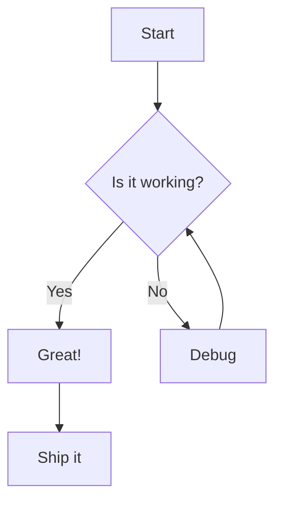
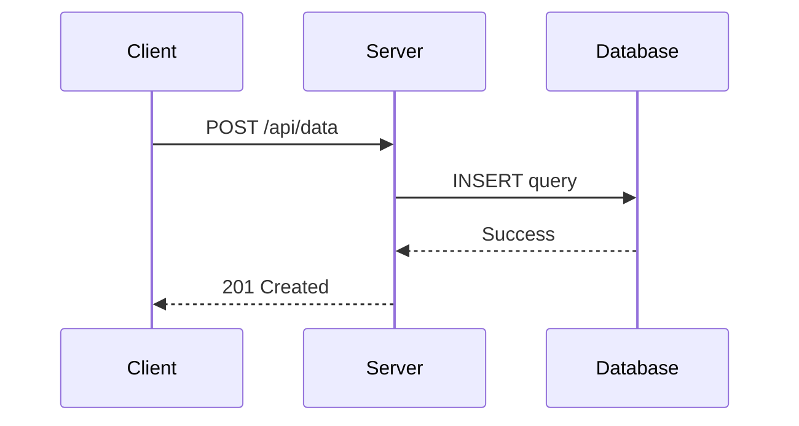
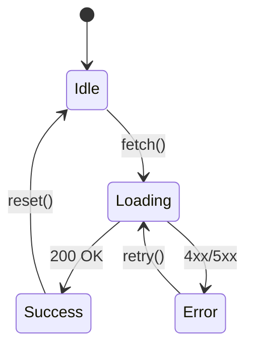

# Streamdown Feature Showcase

This playground demonstrates every feature supported by Streamdown.

---

## Text Formatting

Regular paragraph text with **bold**, *italic*, ***bold italic***, and ~~strikethrough~~ formatting. You can also use `inline code` within text.

---

## Headings

# Heading 1
## Heading 2
### Heading 3
#### Heading 4
##### Heading 5
###### Heading 6

---

## Links and Images

Visit [Streamdown on GitHub](https://github.com/haydenbleasel/streamdown) or paste a raw URL like https://streamdown.dev and it becomes a link automatically.


---

## Blockquotes

> This is a blockquote. It supports **formatting** and *emphasis* inside.
>
> > Blockquotes can also be nested.

---

## Lists

### Unordered Lists

- First item
- Second item
  - Nested item
    - Deeply nested item
- Third item

### Ordered Lists

1. First step
2. Second step
   1. Sub-step A
   2. Sub-step B
3. Third step

### Task Lists

- [x] Completed task
- [X] Also completed
- [ ] Pending task
  - [x] Nested completed task
  - [ ] Nested pending task

---

## Tables

| Feature | Status | Notes |
|:--------|:------:|------:|
| Markdown | Supported | CommonMark compliant |
| GFM | Supported | Tables, tasks, strikethrough |
| Code highlighting | Supported | 200+ languages via Shiki |
| Math | Supported | KaTeX rendering |
| Mermaid | Supported | Flowcharts, sequences, and more |
| CJK | Supported | Chinese, Japanese, Korean |

---

## Code

Inline `code` renders within text. Block code gets syntax highlighting:

```typescript
interface User {
  id: string;
  name: string;
  email: string;
}

async function fetchUser(id: string): Promise<User> {
  const response = await fetch(`/api/users/${id}`);

  if (!response.ok) {
    throw new Error("Failed to fetch user");
  }

  return response.json();
}
```

```python
def fibonacci(n: int) -> list[int]:
    """Generate the first n Fibonacci numbers."""
    sequence = [0, 1]
    for _ in range(2, n):
        sequence.append(sequence[-1] + sequence[-2])
    return sequence[:n]

print(fibonacci(10))
```

```css
:root {
  --primary: #0070f3;
  --background: #ffffff;
}

.container {
  display: grid;
  grid-template-columns: repeat(auto-fit, minmax(300px, 1fr));
  gap: 1.5rem;
  padding: 2rem;
}
```

```bash
# Install Streamdown
npm install streamdown @streamdown/code @streamdown/math @streamdown/mermaid
```

---

## Mathematics

Inline math: $$E = mc^2$$ and $$\sum_{i=1}^{n} i = \frac{n(n+1)}{2}$$.

Block math for display equations:

$$
\int_{-\infty}^{\infty} e^{-x^2} \, dx = \sqrt{\pi}
$$

$$
\begin{bmatrix}
a & b \\
c & d
\end{bmatrix}
\begin{bmatrix}
x \\
y
\end{bmatrix}
=
\begin{bmatrix}
ax + by \\
cx + dy
\end{bmatrix}
$$

$$
f(x) = \begin{cases}
x^2 & \text{if } x \geq 0 \\
-x^2 & \text{if } x < 0
\end{cases}
$$

---

## Mermaid Diagrams

### Flowchart



### Sequence Diagram



### State Diagram



---

## CJK Support

**Chinese:** **你好世界。** Streamdown 支持中文排版。

**Japanese:** *こんにちは。* Streamdown は日本語をサポートしています。

**Korean:** ~~안녕하세요.~~ Streamdown은 한국어를 지원합니다.

---

## Horizontal Rules

Three dashes create a horizontal rule:

---

## HTML Entities

&copy; 2025 &mdash; Streamdown &bull; Built with &hearts;
